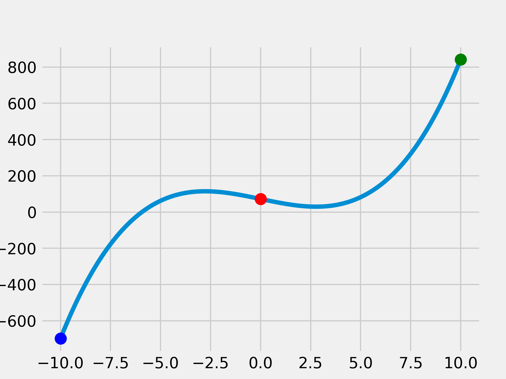

# Simple-Numerical-Analysis-Methods

Python implementation of numerical analysis methods taught in **MA11004**-Spring 2022

### **Example**:
<figure>

<figcaption align=center>Bisection Method</figcaption>
</figure>